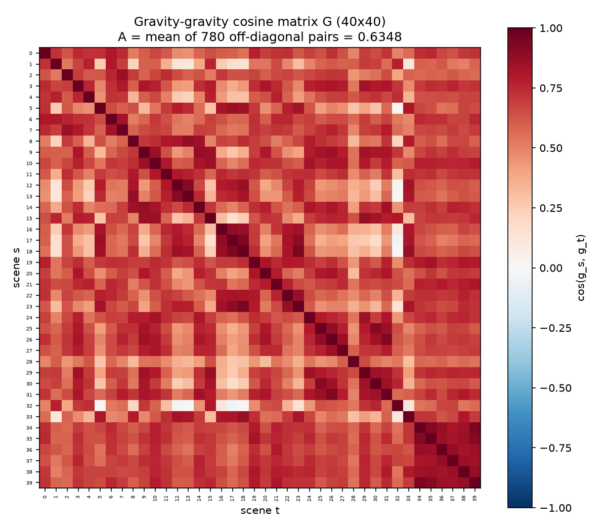
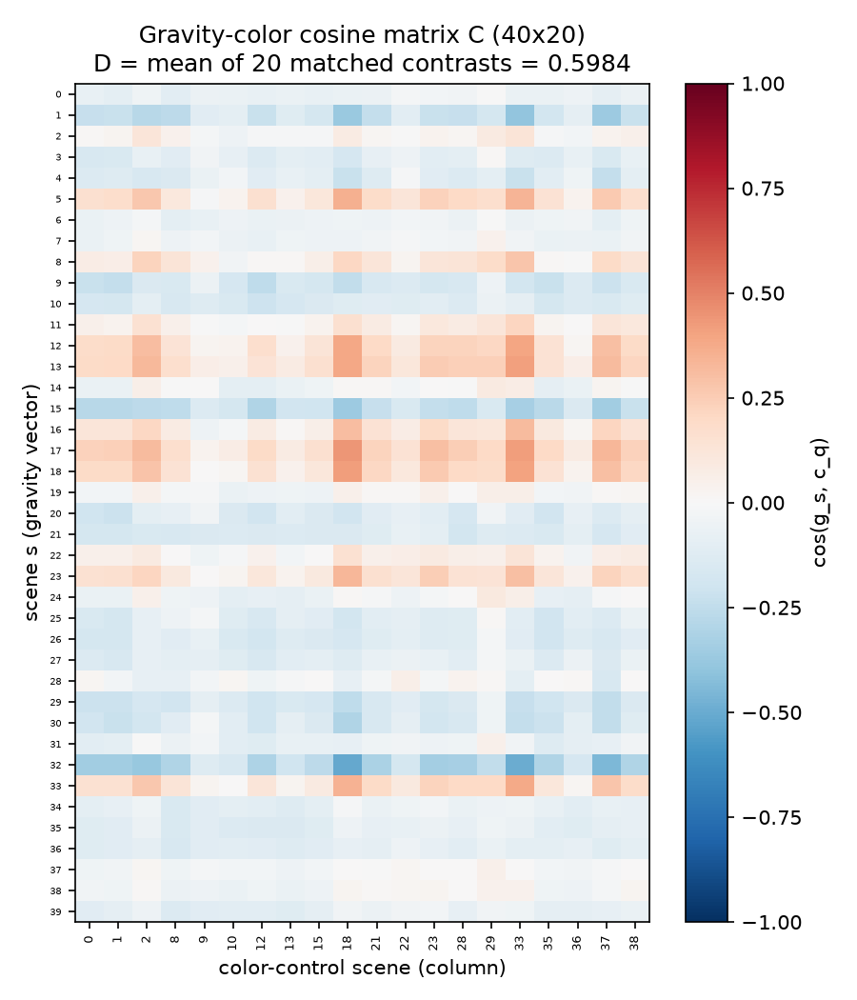
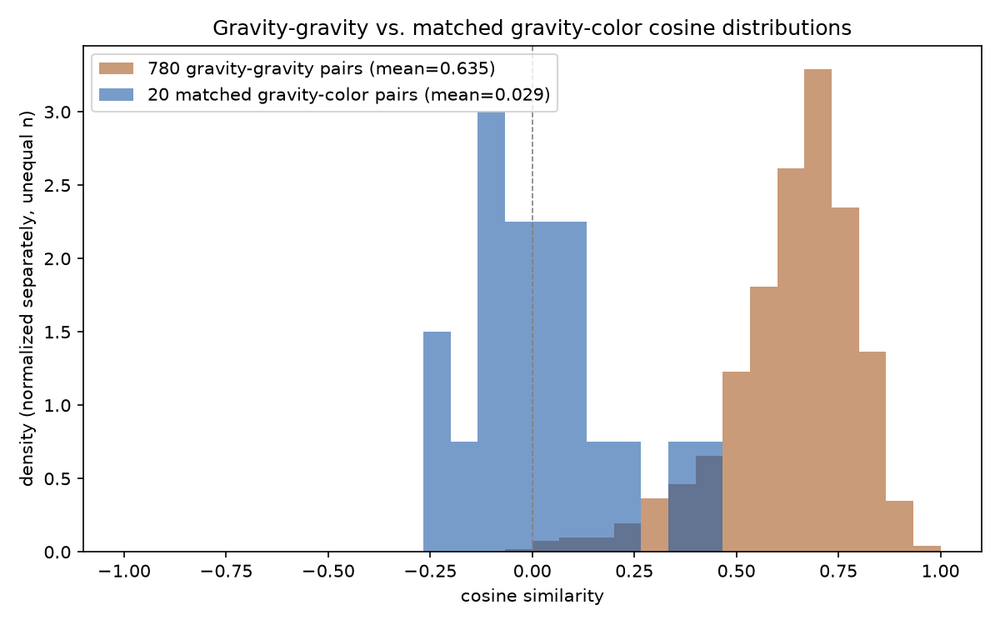
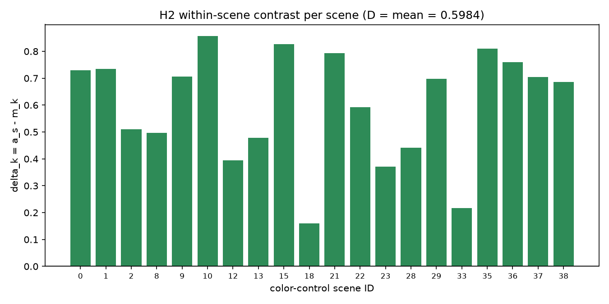
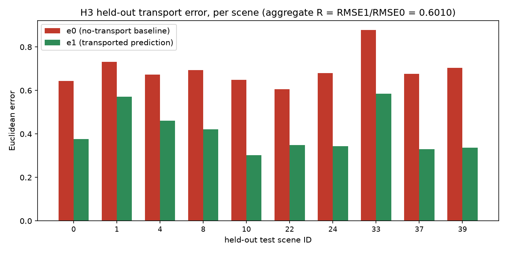

# Minimal gravity latent experiment — final report

**Status: executed and complete.** 100 real videos rendered, 100 real embeddings extracted via a frozen V-JEPA 2.1 ViT-B/16 encoder, all three prespecified hypotheses evaluated on the full design (no subsetting, no partial data).

## Headline result

| | Quantity | Value | Threshold | Outcome |
|---|---|---|---|---|
| **H1** — gravity vectors align across scenes | `A` | **0.6348** | A > 0 | Supports H1 |
| **H2** — gravity change ≠ a color change | `D` | **0.5984** | D > 0 | Supports H2 |
| **H3** — learned displacement transports to unseen scenes | `R` | **0.6010** | R < 1 | Supports H3 |

All three hypotheses met their prespecified directional criteria. Per Document 01's own rule, this permits the **limited combined claim**: *"average alignment, separation from this color control, and transport improvement, in this fixed 40-scene benchmark, for this one checkpoint."* Nothing broader.

## Methodology (brief — full detail in `design/`)

40 scenes, each a ball launched on a ballistic trajectory (`x(t)=x0+15t`, `y(t)=y0+10t-0.5·g·t²`), rendered twice — once at g=9.8 m/s², once at g=4.9 m/s² — with every other pixel-level factor (position, velocity, color, camera, background) held fixed. 20 of those 40 scenes additionally get a color-control clip (orange→blue ball, gravity fixed at 9.8). 100 videos total, each 151 frames @ 30 FPS (5s), rendered as lossless FFV1.

Each video → frozen **V-JEPA 2.1 ViT-B/16 EMA encoder** (strict-loaded, zero missing/unexpected keys, checkpoint SHA-256 `848a77c3...59ddf4d`) → 16 sampled frames → final-layer tokens `[1,4608,768]` → mean-pooled to one 768-d vector. Gravity vector `g_s = z(s,4.9) − z(s,9.8)`; color vector `c_s = z(s,color) − z(s,9.8)`.

Executed on a RunPod RTX 3090 pod: render 67.8s, extract 49.4s, analyze <1s — full 100-clip pipeline in **~2 minutes** of compute.

---

## H1 — gravity–gravity alignment

**A = 0.634761**, computed over all 780 distinct scene pairs (40 choose 2 — the full design count, not a subsample).

| Stat | Value |
|---|---|
| mean | 0.6348 |
| median | 0.6654 |
| population SD | 0.1590 |
| min | −0.0420 |
| max | 0.9441 |

Only **1 of 780** pairwise cosines is negative — the gravity-intervention direction is broadly consistent across scene identities, not driven by a handful of outliers. Per-scene average alignment (`a_s`) ranges from 0.467 (scene 32, the weakest) to 0.711 (scene 38), with 39 of 40 scenes above 0.5.

## H2 — gravity vs. color specificity

**D = 0.598393**, mean of 20 within-scene contrasts `δ_k = a_{q_k} − m_k` (a scene's average gravity-gravity alignment minus its own gravity-color cosine).

| Stat | Matched cosines `m_k` (gravity vs. this scene's own color vector) |
|---|---|
| mean | 0.0294 |
| median | 0.0082 |
| population SD | 0.1713 |
| min | −0.2261 (scene 1) |
| max | 0.4154 (scene 18) |

The matched cosines average essentially **zero** — gravity and color intervention directions are roughly orthogonal in this representation, not opposed. Critically, **every one of the 20 `δ_k` values is positive** (range 0.159–0.857): even the one scene where color happened to align somewhat with gravity (scene 18, m=0.415), the gravity vector still aligns more with *other scenes'* gravity vectors than with its own color change.

## H3 — 30-train / 10-test transport

**R = 0.600966** (RMSE₁/RMSE₀), computed on the full 30-train/10-test split fixed before any inference (`scene_plan.json`, SHA-256 deterministic assignment).

- RMSE₀ (no-transport baseline) = 0.6969, RMSE₁ (transported) = 0.4188 — a **39.9% reduction** in RMSE.
- **f = 1.0** — all 10 held-out scenes individually improved (`e1 < e0` for every one), not a result driven by 1–2 scenes.
- **H = 0.8063** — mean cosine between the learned direction `d_T` and each held-out scene's actual gravity vector; consistently high (range 0.637–0.885 across all 10).

All 10 held-out rows:

| test scene | e₀ | e₁ | r=e₁/e₀ | h |
|---|---|---|---|---|
| 0 | 0.643 | 0.377 | 0.586 | 0.812 |
| 1 | 0.732 | 0.572 | 0.781 | 0.637 |
| 4 | 0.673 | 0.460 | 0.684 | 0.736 |
| 8 | 0.693 | 0.422 | 0.608 | 0.794 |
| 10 | 0.648 | 0.302 | 0.467 | 0.885 |
| 22 | 0.606 | 0.350 | 0.577 | 0.823 |
| 24 | 0.681 | 0.343 | 0.504 | 0.865 |
| 33 | 0.878 | 0.585 | 0.666 | 0.756 |
| 37 | 0.676 | 0.330 | 0.488 | 0.874 |
| 39 | 0.703 | 0.337 | 0.479 | 0.883 |

No held-out failures: no undefined ratios (`e0` never near zero), `‖d_T‖=0.5576` well above the 1e-12 undefined threshold, `RMSE0` well above zero — H3 was fully evaluable with no unevaluable cases.

---

## Implementation deviations from the original design draft

One deviation, made *before* execution and fully documented in `design/01_EXPERIMENT_DESIGN.md` and `scene_plan.json` (`design_revision: ballistic-launch-v3`): the initial physics draft (`vx=2, vy0=0`) produced a visually weak, near-vertical drop rather than a recognizable projectile arc. This was replaced with a proper ballistic launch (`vx=15, vy0=10`) before any rendering or inference — verified numerically in-bounds for all 40 scenes × both gravity values × all 151 frames before use. No other deviation occurred: the executed pipeline matches the frozen math plan exactly (same checkpoint, same pooling, same split algorithm, same undefined-value rules).

## Limitations — stated plainly

- **Descriptive, not inferential.** The 40 scenes are a designed grid, not a random sample from real video. No p-values or confidence intervals are computed anywhere in this analysis; A>0, D>0, R<1 are descriptive thresholds, not statistical significance claims.
- **One synthetic renderer, one checkpoint.** This says nothing about whether the signal survives on real-world footage, a different renderer, or a different V-JEPA checkpoint/scale.
- **No causal disentanglement from trajectory shape.** Changing gravity necessarily changes the visible trajectory here — this experiment cannot separate "the model encodes an abstract gravity variable" from "the model encodes the resulting motion shape." They are confounded by construction.
- **One color control**, not an exhaustive appearance-confound sweep. It also changes luminance, not just hue.
- **All three hypotheses are separate.** The combined claim above only holds because all three independently met their criteria — this is not a single omnibus test, and a future run with a mixed outcome would need to be reported as mixed, not averaged into one verdict.

## Reproduction

Full code, exact checkpoint hash, deterministic scene assignment, and all raw data are in this repository. See `README.md` for exact commands. Raw materials for independent re-analysis: `results/embeddings.json` (all 100 raw 768-d vectors), `results/tables/*.csv` (full cosine matrices, matched-control table, transport table), `results/analysis_summary_full.json` (every number in this report, machine-readable).
